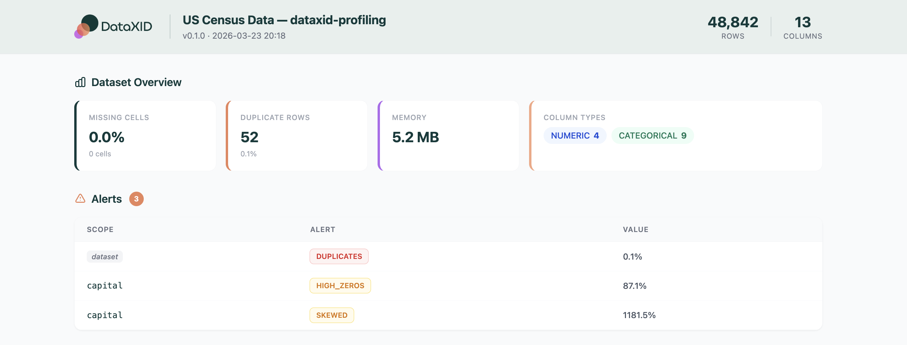
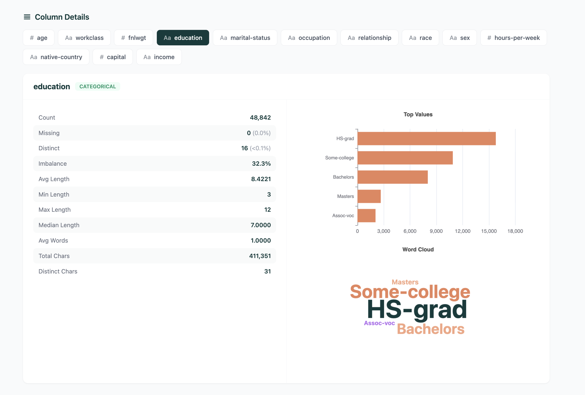
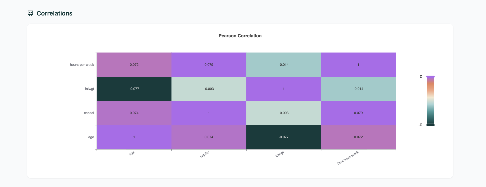

# dataxid-profiling

[](https://pypi.org/project/dataxid-profiling/)
[](https://pypi.org/project/dataxid-profiling/)
[](https://github.com/dataxid/dataxid-profiling/blob/main/LICENSE)

Fast, Polars-native data profiling with interactive HTML reports and data quality alerts.

## Quickstart

```python
import polars as pl
from dataxid_profiling import ProfileReport

df = pl.read_csv("data.csv")
report = ProfileReport(df)
report.to_html("report.html")
```

Pandas works too:

```python
report = ProfileReport(pd.read_csv("data.csv"))
```

## Report Preview

<p align="center">
  
</p>

<p align="center">
  
</p>

<p align="center">
  
</p>

## Highlights

- Built on Polars — two runtime dependencies
- 3 lines to profile any dataset
- Programmatic-first: `.to_dict()`, `.stats`, `.alerts`
- Interactive HTML reports with ECharts
- Accepts Polars, Pandas, CSV, and Parquet
- 5 column types: numeric, categorical, boolean, datetime, text
- 7 data quality alerts out of the box
- Pearson correlation heatmap
- Two modes: `"complete"` for deep analysis, `"overview"` for speed
- Fully typed

## Installation

```bash
pip install dataxid-profiling
```

## Usage

### Programmatic access

```python
report = ProfileReport(df, title="My Data")

stats = report.to_dict()
alerts = report.alerts
column_stats = report.stats["age"]
correlations = report.correlations
```

### JSON export

```python
report.to_json("report.json")
```

### Configuration

```python
from dataxid_profiling import ProfileReport, ProfileConfig

config = ProfileConfig(
    title="My Data",
    mode="overview",
    missing_threshold=0.1,
    histogram_bins=30,
)
report = ProfileReport(df, config=config)
```

### Modes

| Feature | `"complete"` | `"overview"` |
|---|:-:|:-:|
| Basic stats | ✓ | ✓ |
| Histograms & value counts | ✓ | ✓ |
| Correlations | ✓ | ✗ |
| Character analysis | ✓ | ✗ |
| Duplicate rows table | ✓ | ✗ |

## Output formats

| Format | Method | Use case |
|---|---|---|
| HTML | `report.to_html("report.html")` | Interactive report |
| JSON | `report.to_json("report.json")` | Machine-readable |
| Dict | `report.to_dict()` | Python-native |

## Contributing

Contributions are welcome. See [CONTRIBUTING.md](CONTRIBUTING.md) for details.

## Links

- [PyPI](https://pypi.org/project/dataxid-profiling/)
- [Changelog](CHANGELOG.md)
- [GitHub Issues](https://github.com/dataxid/dataxid-profiling/issues)

## License

[Apache-2.0](LICENSE)
